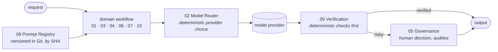

# Free Agentic Workflows in n8n

Ten n8n AI workflows that share four platform services instead of each re-implementing
model routing, output verification, prompt management and human approval.

Every workflow was built, imported and executed on a live n8n instance. Each folder
holds the raw result of the run it claims — pass counts, execution ids, measured
latency. Where something was estimated rather than measured, it says so.



## Platform services

Reusable, called over `Execute Sub-workflow`. 27 cross-workflow calls across the repo.

| # | Service | What it guarantees | Nodes | Measured |
| --- | --- | --- | --- | --- |
| [02](workflows/02-intelligent-model-router/) | **Model Router** | One place picks the model, on explicit rules, with privacy and capability gates and cross-vendor fallback | 25 | [9/9 calls, 9/9 checks](workflows/02-intelligent-model-router/benchmarks/provider-matrix-2026-09-08.json) |
| [05](workflows/05-agent-governance/) | **Governance / HITL** | Nothing risky executes without a decision; CRITICAL denies by default | 24 | [12/12 fixtures](workflows/05-agent-governance/tests/results-2026-09-08.json), p50 20 ms |
| [08](workflows/08-gitops-prompt-management/) | **Prompt Registry** | Every prompt is versioned in Git and returned with its commit SHA | 12 | [7/7 fixtures](workflows/08-gitops-prompt-management/tests/results-2026-09-08.json), p50 200 ms |
| [09](workflows/09-ai-output-verification/) | **Verification** | Nothing ships unverified, and the first check is deterministic | 19 | [10/10 fixtures](workflows/09-ai-output-verification/tests/results-2026-09-08.json), p50 20 ms |

## Domain workflows

| # | Workflow | What it does | Nodes | Measured |
| --- | --- | --- | --- | --- |
| [01](workflows/01-autonomous-api-integration-engineer/) | **API Integration Engineer** | Parses an OpenAPI spec, plans an integration, checks every proposed step against the real operation list, probes read-only endpoints | 25 | [6/6 readiness, 2/2 probes, 0 invented endpoints](workflows/01-autonomous-api-integration-engineer/benchmarks/demo-runs-2026-09-08.json) |
| [03](workflows/03-production-rag-intelligence/) | **RAG Platform** | Metadata-filtered retrieval, hybrid rerank, citation-bound answers, explicit no-answer path | 27 | [5/5 fixtures](workflows/03-production-rag-intelligence/tests/results-2026-09-08.json), p50 8.2 s |
| [04](workflows/04-autonomous-research-agent/) | **Research Agent** | Plans sub-questions, searches the live web, deduplicates evidence, writes a cited report | 21 | [2 runs, 0 fabricated citations](workflows/04-autonomous-research-agent/tests/results-2026-09-08.json) |
| [06](workflows/06-financial-document-intelligence/) | **Financial Documents** | Invoice extraction with arithmetic reconciliation, duplicate fingerprinting, exception taxonomy | 25 | [12/12 fixtures](workflows/06-financial-document-intelligence/tests/results-2026-09-08.json), p50 572 ms deterministic |
| [07](workflows/07-conversational-analytics/) | **Conversational Analytics** | Natural-language questions where the model never writes SQL — it emits a spec that is compiled | 22 | [1 run, execution 334](workflows/07-conversational-analytics/sample-output.json) |
| [10](workflows/10-realtime-voice-agent/) | **Voice Agent** | Webhook to speech: transcribe, classify against a closed tool registry, gate, verify, speak | 23 | [2/2 webhook runs](workflows/10-realtime-voice-agent/tests/results-2026-09-08.json) |

223 nodes in total. Every result above links to the raw JSON it came from.

### What "verified" means, and does not

Each workflow ran on a real n8n instance against real model providers — and where
applicable real external APIs — and its assertions passed. The linked file names the
n8n execution id.

It does not mean load-tested, security-audited, or scored against a labelled
ground-truth set. Sample sizes are small: the router benchmark is one run per
(task, provider) cell, so its percentiles are indicative, not SLOs. 04 and 10 record
demo runs rather than fixture suites, and 10's audio-upload path is structurally
valid but was exercised only via the text payload.

## Four decisions the repo turns on

**Hallucinated endpoints are caught by set membership, not opinion.** 01 checks every
`operationId` the model proposes against the operations the spec declares. A plausible
invented endpoint fails with certainty.

**The analytics agent cannot write SQL.** 07's model emits a query spec. A compiler
validates every metric, dimension and filter against a fixed registry and assembles
parameterised SQL from registry column names. Prompt injection cannot widen what is
queryable — at worst it gets rejected.

**Fabricated citations are string matching.** 09 extracts every URL and `[S#]` marker
from an answer and checks it against the sources actually supplied. No second model
needed. That is why 04 can report 0 fabricated citations as a fact.

**Estimates and measurements never share a key.** Router responses carry
`measured.latency_ms` and `estimated.cost_usd` separately, so no document downstream
can quietly present one as the other.

## Import

```bash
git clone https://github.com/Tejesh080/Free-Agentic-Workflows-in-N8N.git
cd Free-Agentic-Workflows-in-N8N
cp .env.example .env          # set N8N_BASE_URL and N8N_API_KEY
python scripts/import-workflows.py --dry-run
python scripts/import-workflows.py
```

The script creates all ten workflows and rewrites all 33 sub-workflow references to
the new ids. To import by hand instead, load each `workflows/*/workflow.json` in the
n8n editor — sub-workflow nodes carry the placeholder `REPLACE_WITH_YOUR_WORKFLOW_ID`
and name their target in the node's cached label, so they can be relinked manually.

Either way, afterwards:

1. Create the five data tables in [docs/CONNECTIONS.md](docs/CONNECTIONS.md). The n8n
   public API does not expose data tables, so this step is manual.
2. Select a credential wherever a node asks for one.
3. **Publish 02, 05, 08 and 09 first** — a sub-workflow must be published before
   another workflow can call it.
4. Fire each workflow's test-suite or demo trigger to confirm the wiring.

## Connections

With n8n AI Gateway credits, Gemini, OpenAI, Anthropic and Firecrawl get managed
credentials automatically and **no API keys of your own are needed**. That is how
every measured result here was produced.

Optional and not required to run the demos: Telegram (05's approval channel), Qdrant
(03 uses the in-memory store), Postgres (07 uses an n8n Data Table). Full setup,
including data table column definitions, is in
**[docs/CONNECTIONS.md](docs/CONNECTIONS.md)**.

## Security

Exports are sanitised by `scripts/sanitize-workflow.py`, which strips credential ids,
`meta.instanceId`, `pinData`, webhook ids, top-level workflow ids and the server-side
`activeVersion` block, and replaces sub-workflow and data table ids with placeholders. `scripts/security-check.py` scans
every tracked file for secrets and leaked identifiers; `validate-workflows.py` and
`validate-prompts.py` check structure offline.

These workflows call external model providers and, in 01 and 04, external websites.
Read what a workflow does before pointing it at anything you care about. 01 never
executes a write operation even when Governance approves it, and 10 never executes a
data-changing intent — the approval is recorded for a human instead. Those limits are
deliberate.

## Provenance and licence

These workflows were written from scratch. They were informed by studying a private
archive of community n8n templates, but no source file was copied — those files carry
other operators' instance ids, credential ids and captured runtime payloads, and their
redistribution rights are unknown. [docs/PROVENANCE.md](docs/PROVENANCE.md) records
what was taken from each source as an idea and what is new here.

MIT — see [LICENSE](LICENSE). It covers this repository's own contents only.
