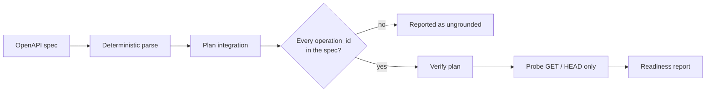

# 01 — API Integration Engineer

Reads an OpenAPI spec, plans an integration, and checks every step the model proposes against the operations the spec actually declares.

`Live tested` · [`workflow.json`](workflow.json)

## What it does

- Parses the spec deterministically — no model touches the operation list.
- Grounds the plan: an `operation_id` that is not in the spec fails, so an invented endpoint cannot survive.
- Takes method, path and write effect from the spec, never from the model.
- Probes only GET and HEAD, only against the spec's own base URL.
- Write steps go to Governance and are recorded — never executed.

## Flow

Calls 02 Model Router, 05 Governance, 08 Prompt Registry, 09 Verification.

## Setup

- Any HTTP API described by an OpenAPI 3 document

Run it from `Integration Request` or `Demo Trigger`.

Credentials and data tables: [docs/CONNECTIONS.md](../../docs/CONNECTIONS.md)

## Test evidence

| Result | Raw output |
| --- | --- |
| 5 recorded runs | [`benchmarks/demo-runs-2026-09-08.json`](benchmarks/demo-runs-2026-09-08.json) |

latency_ms values are MEASURED wall clock. estimated_cost_usd comes from the Model Router and is an ESTIMATE from configured list prices.

## Limitations

- JSON OpenAPI 3 only. YAML specs are rejected with a clear message.
- `$ref` is not dereferenced, so response field checking uses observed keys rather than the resolved schema.
- The probe stage cannot exercise endpoints that require authentication.
