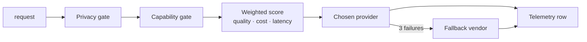

# 02 — Intelligent Model Router

Picks a model per request from explicit rules, with privacy and capability gates and cross-vendor fallback.

`Live tested` · [`workflow.json`](workflow.json)

## What it does

- Scores Gemini, OpenAI and Anthropic on quality prior, blended token price and latency.
- Runs hard gates before scoring: privacy locality, JSON mode, minimum quality, context size.
- Refuses `privacy=local_only` rather than quietly downgrading it to a cloud provider.
- `force_provider` can bypass the capability gate. It can never bypass the privacy gate.
- Retries three times, fails over to a different vendor, and writes a telemetry row.

## Flow

Called by 01, 03, 04, 06, 07, 09, 10.

## Setup

- Google Gemini
- OpenAI
- Anthropic

Run it from `Router Request` or `Benchmark Trigger`.

Credentials and data tables: [docs/CONNECTIONS.md](../../docs/CONNECTIONS.md)

## Test evidence

| Result | Raw output |
| --- | --- |
| 9 recorded runs | [`benchmarks/provider-matrix-2026-09-08.json`](benchmarks/provider-matrix-2026-09-08.json) · execution `153` |

latency_ms_* are MEASURED wall-clock times inside n8n and include network, provider queueing and retry time. estimated_cost_usd values are ESTIMATES from configured list prices with tokens approximated as characters/4; the n8n LangChain chain nodes do not surface provider-reported token counts.

## Limitations

- Quality priors and prices are configured values, not measurements. Re-check prices before trusting a cost figure.
- No local provider is wired. The registry has a commented example.
