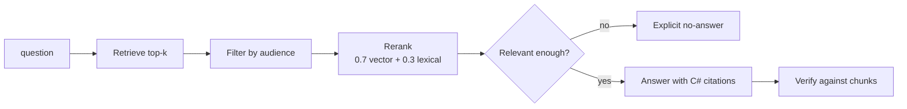

# 03 — RAG Intelligence

Retrieval with metadata access control, deterministic reranking and citation-bound answers.

`Live tested` · [`workflow.json`](workflow.json)

## What it does

- Chunks with `doc_id`, `title`, `category`, `audience` and `effective_from` metadata.
- Filters on audience before the model sees anything — an internal document is never returned to a public caller.
- Reranks `0.7 × vector + 0.3 × lexical overlap`, which rescues exact-term matches that embeddings rank low.
- Gates on relevance, so closest-in-the-store is not treated as evidence.
- Answers with `[C#]` citations and checks them against the chunks that were retrieved.

## Flow

Calls 02 Model Router, 08 Prompt Registry, 09 Verification.

## Setup

- OpenAI embeddings
- Qdrant (optional, production swap)

Runs credential-free on the in-memory Simple Vector Store. Qdrant is the documented production swap and needs QDRANT_URL and QDRANT_API_KEY.

Run it from `Ingest Corpus` or `RAG Query` or `Test Suite Trigger`.

Credentials and data tables: [docs/CONNECTIONS.md](../../docs/CONNECTIONS.md)

## Test evidence

| Result | Raw output |
| --- | --- |
| 5/5 fixtures passed | [`tests/results-2026-09-08.json`](tests/results-2026-09-08.json) · execution `377` |

R03 and R04 ask the SAME question with different audiences. That pairing is what makes the access-control result meaningful: proving a document is blocked only means something if you also prove it would otherwise have been returned.

## Limitations

- The demo uses n8n's in-memory Simple Vector Store, which does not survive a restart. Qdrant is the documented production swap.
- Retrieval quality has not been measured against a labelled ground-truth set. The fixtures prove behaviour, not ranking quality.
- The corpus is eight invented documents.
