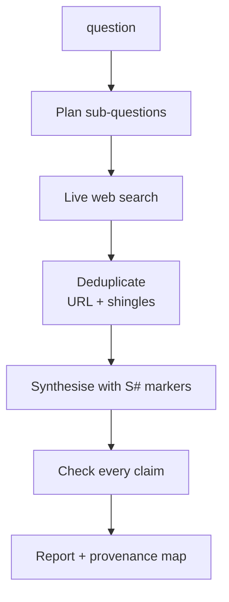

# 04 — Research Agent

Plans sub-questions, searches the live web, and checks every claim in the report against the sources it actually retrieved.

`Live tested` · [`workflow.json`](workflow.json)

## What it does

- Deduplicates twice: exact normalised URL, then 3-word shingles at a Jaccard threshold of 0.8.
- Requires an `[S#]` marker after every factual sentence.
- Checks each marker and URL against the collected evidence by string match, not by asking another model.
- Maps what was cited, what was collected but unused, and any marker that was invented.
- Stops and reports a gap when search returns nothing, rather than writing an unsourced answer.

## Flow

Calls 02 Model Router, 08 Prompt Registry, 09 Verification.

## Setup

- Firecrawl (web search and scrape)

Run it from `Research Request` or `Demo Trigger`.

Credentials and data tables: [docs/CONNECTIONS.md](../../docs/CONNECTIONS.md)

## Test evidence

| Result | Raw output |
| --- | --- |
| 2 recorded runs | [`tests/results-2026-09-08.json`](tests/results-2026-09-08.json) |

Live web results change over time, so the exact sources and figures will differ on a re-run. What is asserted here is structural: sources were retrieved and deduplicated, the report cited only real markers, and every claim was checked against the retrieved evidence.

## Limitations

- The entailment judge evaluates at most 15 claims per call; longer reports report `claims_truncated`.
- No source-quality weighting: a blog and a primary regulator carry equal weight.
