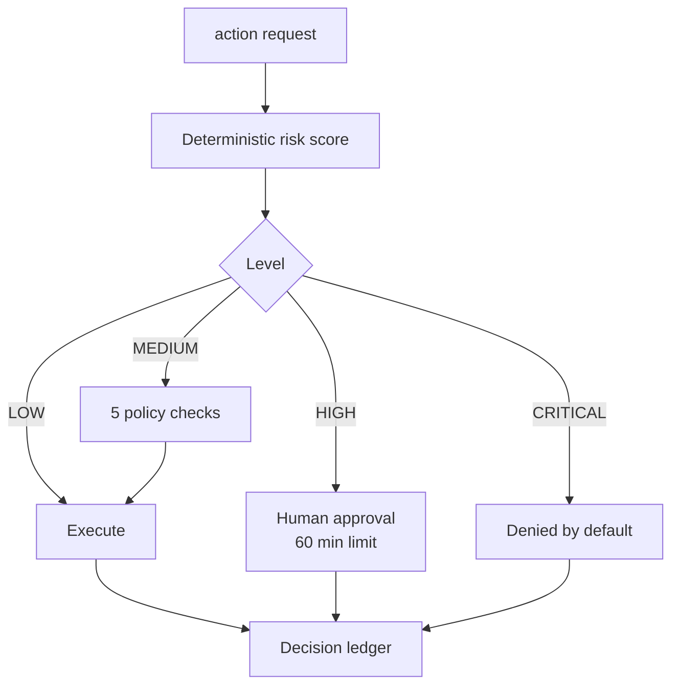

# 05 — Human Approval & Governance

Deterministic risk classification with a human in the loop, and deny-by-default for the worst case.

`Live tested` · [`workflow.json`](workflow.json)

## What it does

- Scores risk from the action type, then raises it on destructive verbs, production targets, money, bulk operations and personal data.
- LOW executes. MEDIUM passes five policy checks first. HIGH waits for a human. CRITICAL is denied.
- Levels can only be raised, never lowered; an unrecognised action type defaults to HIGH.
- A timeout, a channel error and a malformed reply all resolve to rejected.
- A request arguing that it is already pre-approved is treated as a suspected injection and raised to CRITICAL.

## Flow

Called by 01, 06, 10.

## Setup

- Telegram (human approval channel, optional for testing)

The classification engine and all four risk tiers are testable with no credentials via simulate_decision. Only the real human-approval leg needs a Telegram bot and chat id.

Run it from `Governance Request` or `Test Suite Trigger`.

Credentials and data tables: [docs/CONNECTIONS.md](../../docs/CONNECTIONS.md)

## Test evidence

| Result | Raw output |
| --- | --- |
| 12/12 fixtures passed | [`tests/results-2026-09-08.json`](tests/results-2026-09-08.json) · execution `187` |

Risk classification, routing, policy validation and the deny-by-default rule are fully exercised. The Telegram approval leg is NOT exercised here; ledger rows from this suite carry decided_by='simulated:test-harness' so they can never be mistaken for real human approvals.

## Limitations

- The MEDIUM allow-list of target systems is a demo list and must be replaced for real use.
- Approvals are not cryptographically signed.
