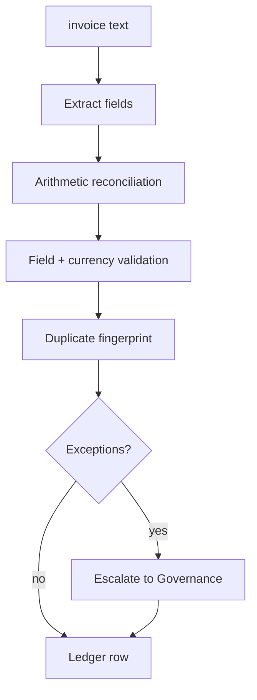

# 06 — Document Intelligence

Invoice extraction that checks the arithmetic instead of trusting well-formed JSON.

`Live tested` · [`workflow.json`](workflow.json)

## What it does

- Reconciles line items against subtotal, subtotal plus tax against total, and quantity × unit price against each line, to 0.02.
- Validates document type, required fields, ISO 4217 currency, date sanity and implied tax rate.
- Fingerprints on vendor, invoice number, currency and total, and checks a ledger for duplicates.
- Tells the extractor **not** to correct a printed total that disagrees with the lines — fixing it silently would hide the discrepancy.
- Escalates anything carrying an exception to Governance.

## Flow

Calls 02 Model Router, 05 Governance, 08 Prompt Registry, 09 Verification.

## Setup

No credentials of its own beyond the shared services it calls.

Run it from `Document Request` or `Test Suite Trigger`.

Credentials and data tables: [docs/CONNECTIONS.md](../../docs/CONNECTIONS.md)

## Test evidence

| Result | Raw output |
| --- | --- |
| 12/12 fixtures passed | [`tests/results-2026-09-08.json`](tests/results-2026-09-08.json) · execution `262` |

All vendor names, invoice numbers and amounts are invented. Eleven cases supply a pre-parsed extraction so the reconciliation, duplicate and exception logic is exercised without model variance; I12 runs the real extraction path.

## Limitations

- Text in, no OCR or vision stage. Feed it text extracted upstream.
- Single currency per document; no FX conversion.
- The duplicate fingerprint is exact — a re-issued invoice with a changed number is not caught.
