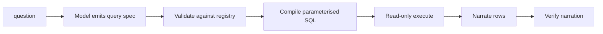

# 07 — Conversational Analytics

Natural-language questions over a warehouse where the model never writes SQL.

`Live tested` · [`workflow.json`](workflow.json)

## What it does

- The model emits a query spec: metric names, dimensions, filters, a date range and a limit.
- Every name is validated against a fixed registry, and anything unknown is discarded.
- SQL is assembled from registry column names, with user values bound as `$1, $2, …` parameters.
- The compiled SQL and its parameters come back with every answer, so a result can be audited.
- The worst a prompt injection achieves is having its spec rejected.

## Flow

Calls 02 Model Router, 08 Prompt Registry, 09 Verification.

## Setup

- Postgres (optional, production swap)
- Google Search Console (optional)

Ships with a synthetic demo warehouse in an n8n Data Table and needs no database credentials.

Run it from `Analytics Question` or `Seed Demo Warehouse` or `Demo Trigger`.

Credentials and data tables: [docs/CONNECTIONS.md](../../docs/CONNECTIONS.md)

## Test evidence

| Result | Raw output |
| --- | --- |
| 1 recorded run | [`sample-output.json`](sample-output.json) · execution `334` |

Verbatim output of execution 334 on 2026-09-08 against the synthetic demo warehouse.

## Limitations

- The demo warehouse is an n8n Data Table with 90 synthetic rows; aggregation happens in memory.
- The registry covers four metrics and five dimensions. Anything outside it returns `unsupported`.
- No joins across tables.
