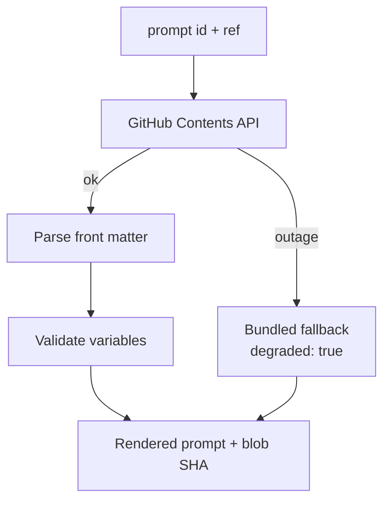

# 08 — Prompt Registry

Prompts live in Git rather than inside workflow JSON, and every render reports the blob SHA it came from.

`Live tested` · [`workflow.json`](workflow.json)

## What it does

- Fetches prompt files through the GitHub Contents API at any Git ref, defaulting to `main`.
- Validates the caller's variables against the prompt's declared contract before interpolating.
- Refuses a prompt with an unfilled `{{placeholder}}` rather than sending it to a model.
- Returns the blob SHA, so an execution log ties back to exact prompt bytes.
- On a GitHub outage returns a bundled fallback flagged `degraded: true` — never silent non-Git text.

## Flow

Called by 01, 03, 04, 06, 07, 10.

## Setup

- GitHub Contents API (anonymous)

Run it from `Prompt Request` or `Test Suite Trigger`.

Credentials and data tables: [docs/CONNECTIONS.md](../../docs/CONNECTIONS.md)

## Test evidence

| Result | Raw output |
| --- | --- |
| 7/7 fixtures passed | [`tests/results-2026-09-08.json`](tests/results-2026-09-08.json) · execution `200` |

latency_ms_measured includes the GitHub round trip. Cases that hit the local cache path (P02, P03, P07 reuse an already-fetched blob within the same GitHub edge cache window) are visibly faster; that is real, not smoothed.

## Limitations

- The anonymous GitHub API allows 60 requests/hour per IP. Add a token for heavy use.
- No caching layer: every render is a live fetch.
- Bundled fallbacks exist for two hot-path prompts, not all twelve.
