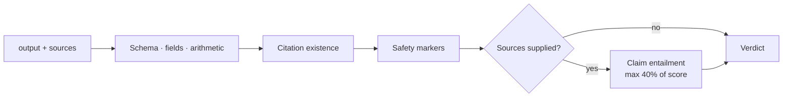

# 09 — Output Verification

Deterministic checks first; an LLM judge is one weighted signal, never the whole verdict.

`Live tested` · [`workflow.json`](workflow.json)

## What it does

- Checks JSON Schema conformance, required fields, arithmetic rules, citation existence and safety markers.
- Decomposes the remaining prose into checkable claims, dropping headings and list lead-ins.
- Only then asks a model to label claims SUPPORTED, CONTRADICTED or NOT_STATED, in one batched call.
- Caps the judge at 40% of the score, and only when it actually ran.
- Degrades a failed or malformed judge to 'not evaluated' with `verified: false` — not a silent pass.

## Flow

Calls 02 Model Router.

Called by 01, 03, 04, 06, 07, 10.

## Setup

No credentials of its own beyond the shared services it calls.

Run it from `Verification Request` or `Test Suite Trigger`.

Credentials and data tables: [docs/CONNECTIONS.md](../../docs/CONNECTIONS.md)

## Test evidence

| Result | Raw output |
| --- | --- |
| 10/10 fixtures passed | [`tests/results-2026-09-08.json`](tests/results-2026-09-08.json) · execution `174` |

latency_ms_measured is MEASURED wall-clock time per verification call. F06 and F07 make a real model call through the Model Router; the other eight cases are fully deterministic and make no model call at all.

## Limitations

- At most 15 claims per call; beyond that `claims_truncated` is reported.
- The JSON Schema validator is a documented subset, not a full implementation.
- Groundedness quality depends on the judge model.
