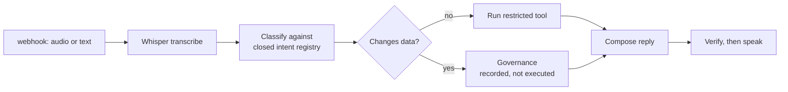

# 10 — Voice Agent

Webhook to speech, with intent classification against a closed registry and a gate before anything can act.

`Live tested` · [`workflow.json`](workflow.json)

## What it does

- Transcribes with Whisper, or accepts a text payload for testing.
- Classifies against a closed registry of five intents; an invented name becomes `unsupported`.
- Reads whether an intent changes data from the registry, not from the model.
- Sends data-changing intents to Governance and records the decision — it never executes them.
- Measures latency per stage, so the slow step is visible rather than averaged away.

## Flow

Calls 02 Model Router, 05 Governance, 08 Prompt Registry, 09 Verification.

## Setup

- OpenAI Whisper (speech to text)
- OpenAI TTS (text to speech)

Run it from `Voice Webhook` or `Respond to Caller`.

Credentials and data tables: [docs/CONNECTIONS.md](../../docs/CONNECTIONS.md)

## Test evidence

| Result | Raw output |
| --- | --- |
| 2/2 fixtures passed | [`tests/results-2026-09-08.json`](tests/results-2026-09-08.json) |

latency_measured_ms is real per-stage wall clock. Transcription is near zero on these runs because they used the text-payload path; a real audio upload adds the speech-to-text call.

## Limitations

- The audio upload path is structurally validated but was not exercised end to end. Text-to-speech is.
- No conversation memory across turns.
- Demo tools return invented static data.
