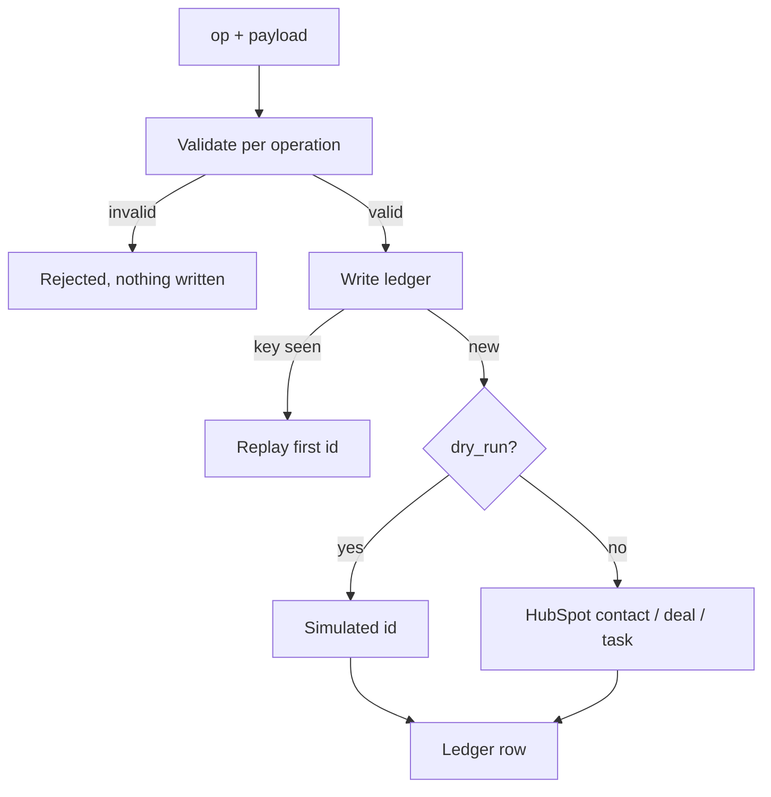

# 11 — CRM Sync Service

Every CRM write in the swarm goes through here, once, whatever the caller retries.

`Live tested` · [`workflow.json`](workflow.json)

## What it does

- Supports three operations only: contact upsert, deal create, task create. Anything else is refused before a request is built.
- Checks a write ledger **before** the CRM, so a replayed webhook returns the first object id instead of creating a second contact.
- Validates the payload per operation - an upsert without an email never reaches HubSpot.
- `dry_run=true` simulates the write and derives the id from the payload digest, so the same payload always simulates to the same id.
- Returns one flat verdict whatever happened: written, simulated, replayed or rejected, each with its reason.

## Flow

Called by 14.

## Setup

- HubSpot

The three HubSpot nodes ship disabled with their configuration intact. Add a HubSpot App Token credential, enable them, and the live write path works; leave them alone and `dry_run=true` keeps the rest of the swarm testable.

Run it from `CRM Request` or `Test Suite Trigger`.

Credentials and data tables: [docs/CONNECTIONS.md](../../docs/CONNECTIONS.md)

## Test evidence

| Result | Raw output |
| --- | --- |
| 10/10 fixtures passed | [`tests/results-2026-09-12.json`](tests/results-2026-09-12.json) · execution `901` |

Every case runs with dry_run=true, so no HubSpot call is made. C01/C02 share a run-scoped idempotency key; C08 sends the identical lead as a second tenant and C08x asserts the two are not conflated; C09 refuses a tenant id that could smuggle a separator into a composite key. Re-run on this execution after the three HubSpot nodes were replaced with 2026-09 CRM API calls: no regression, and the HubSpot calls themselves remain unexercised because no credential exists on this instance.

## Limitations

- The three HubSpot nodes ship **disabled**. A node with a missing required credential blocks publishing, and an unpublished sub-workflow cannot be called. Add the credential, then enable them.
- Contact upsert writes two custom properties, `swarm_lead_score` and `swarm_lead_tier`. Create them in HubSpot first, or remove them from the node.
- The live write path is not exercised by the suite, because this instance has no HubSpot portal. Everything except the three HubSpot calls is.
- A task is used where a note would read more naturally; the n8n HubSpot node offers call, email, meeting and task engagements, not notes.
