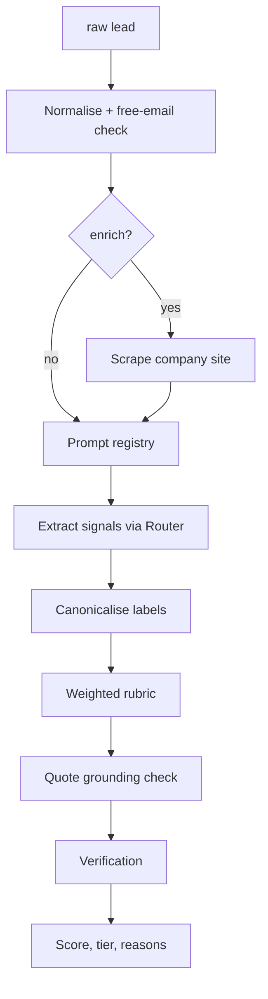

# 12 — Lead Qualification

The model labels the lead. It never scores it.

`Live tested` · [`workflow.json`](workflow.json)

## What it does

- Asks for seven signals from a closed value set, plus a verbatim quote for each one that is not `unknown`.
- Turns labels into points with fixed weights, so the same lead always produces the same number and every point names its component.
- Checks each quote against the text the model was given. A quote that is not there costs 10 points and forces review, rather than passing as evidence.
- Caps rather than trusts: four unknowns cap the score at 45, and an out-of-ICP use case caps it at 15 however strong the buying intent.
- Canonicalises near-miss labels such as `VP` and `201-1000 employees`, and refuses to guess at anything else - an unreadable label scores zero and is named in the verdict.

## Flow

Calls 02 Model Router, 08 Prompt Registry, 09 Verification.

Called by 14.

## Setup

- Firecrawl

Run it from `Qualification Request` or `Test Suite Trigger`.

Credentials and data tables: [docs/CONNECTIONS.md](../../docs/CONNECTIONS.md)

## Test evidence

| Result | Raw output |
| --- | --- |
| 15/15 fixtures passed | [`tests/results-2026-09-12.json`](tests/results-2026-09-12.json) · execution `873` |

Q01-Q08 supply signals directly, so each asserts an exact rubric score and makes no model call. Q09 runs the real model through the GitHub-hosted prompt registry rather than the bundled fallback. Q10/Q11 exercise rubric overrides. Q12/Q13 point enrichment at a cloud metadata address and a reserved suffix and assert both are refused without a network call.

## Limitations

- The weights are a starting point, not a measured model. Re-fit them against closed-won data before trusting the tiers.
- Enrichment is a single page scrape of the company domain, which says little about a large company.
- The grounding check is exact substring matching, so a correctly paraphrased quote is treated as unsupported.
- A free-email domain costs 8 points, which is wrong for founders who use one deliberately.
