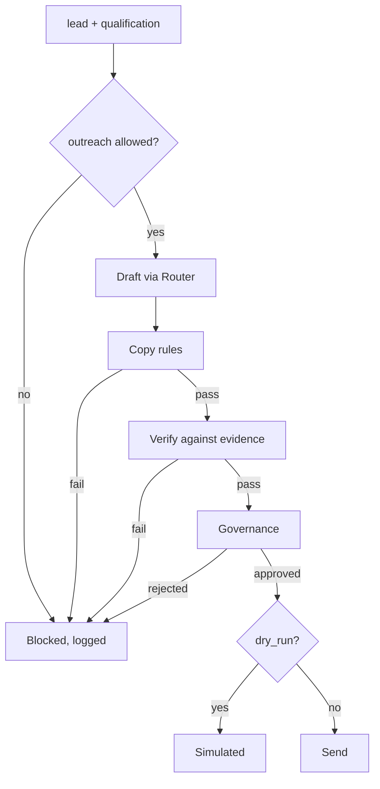

# 13 — Outreach Composer

A message to a real person is a HIGH-risk action, so a human approves it.

`Live tested` · [`workflow.json`](workflow.json)

## What it does

- Drafts from the prompt registry through the Model Router, with the collected evidence as the only thing it may assert.
- Runs deterministic copy rules first: length per channel, placeholder leaks, banned phrases, links, and any figure that is not in the evidence.
- Refuses locally when a rule fails, so a draft with a fabricated number never becomes a question for a human.
- Classifies the send through Governance, which rates `send` HIGH and waits for approval. An operator can lower it to `write`, and that choice is recorded on every log row.
- Logs the outcome either way, including the stage a blocked message was stopped at.

## Flow

Calls 02 Model Router, 05 Governance, 08 Prompt Registry, 09 Verification.

Called by 14.

## Setup

- Telegram

Telegram is the only channel wired to a real credential, and it needs a chat id from the caller. Email and SMS are drafted and approved, then recorded as not configured.

Run it from `Outreach Request` or `Test Suite Trigger`.

Credentials and data tables: [docs/CONNECTIONS.md](../../docs/CONNECTIONS.md)

## Test evidence

| Result | Raw output |
| --- | --- |
| 10/10 fixtures passed | [`tests/results-2026-09-12.json`](tests/results-2026-09-12.json) · execution `585` |

Every case runs with dry_run=true and asserts sent=false. O01-O09 supply the draft; O10 drafts with the real model. Governance decisions for HIGH and CRITICAL cases use simulate_decision in place of the Telegram round trip.

## Limitations

- Only Telegram can actually send. Email and SMS are drafted, checked and approved, then recorded as `channel_not_configured`.
- Governance scans the draft text as well as the operation, so copy offering to delete something is escalated to CRITICAL and denied. That false positive is deliberate.
- The banned-phrase list is a short opinionated one, not a style guide.
- The figure check allows meeting durations; every other number must appear in the evidence verbatim.
