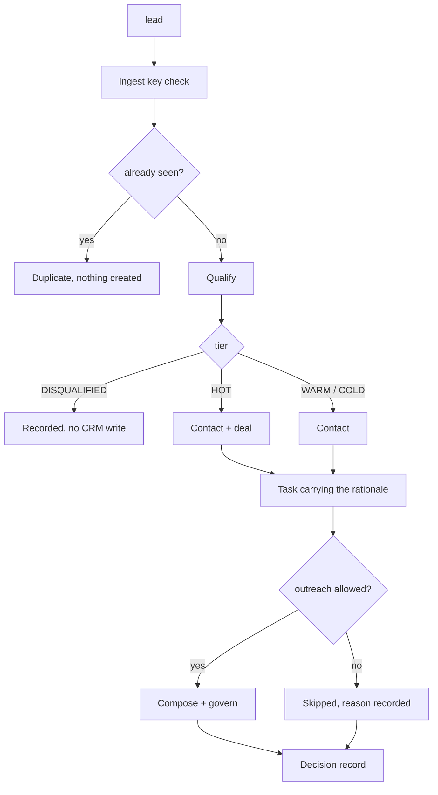

# 14 — Revenue Swarm

One lead in, one decision record out, naming every step taken and every step skipped.

`Live tested` · [`workflow.json`](workflow.json)

## What it does

- Takes a lead from a webhook or from another workflow, and checks a shared secret before anything else on the public path.
- Refuses a lead already in the ledger instead of re-qualifying it, so a retried webhook creates nothing.
- Qualifies through 12, then writes only what the tier justifies: HOT gets a deal, WARM and COLD do not, DISQUALIFIED is never written to the CRM at all.
- Writes the scoring rationale into the CRM task, so a salesperson reads why the number is what it is rather than just the number.
- Returns the full record: score, components, CRM ids, the drafted message, the governance decision and the latency.

## Flow

Calls 11 CRM Sync, 12 Lead Qualification, 13 Outreach Composer.

## Setup

No credentials of its own beyond the shared services it calls.

The public webhook is guarded by an `x-swarm-key` header checked against a `SWARM_INGEST_KEY` n8n variable rather than a credential. While that variable is unset, every inbound lead is refused.

Run it from `Swarm Request` or `Test Suite Trigger` or `Lead Webhook`.

Credentials and data tables: [docs/CONNECTIONS.md](../../docs/CONNECTIONS.md)

## Test evidence

| Result | Raw output |
| --- | --- |
| 8/8 fixtures passed | [`tests/results-2026-09-12.json`](tests/results-2026-09-12.json) · execution `664` |

Six leads through the whole pipeline in dry run plus a second-workspace case. S01-S05 fix the tier by supplying signals so the CRM assertions are exact; S06 runs the real model; S07/S07x assert workspace isolation.

## Limitations

- The webhook needs a `SWARM_INGEST_KEY` n8n variable. Until it is set every inbound lead is refused, which is the intended failure direction.
- Dedupe is on email for all time, with no re-engagement window. A lead who returns a year later is a duplicate.
- `dry_run` defaults to true. Nothing reaches a CRM or an inbox until a caller passes `dry_run=false`.
- One lead per request. There is no batch intake and no nurture sweep.
