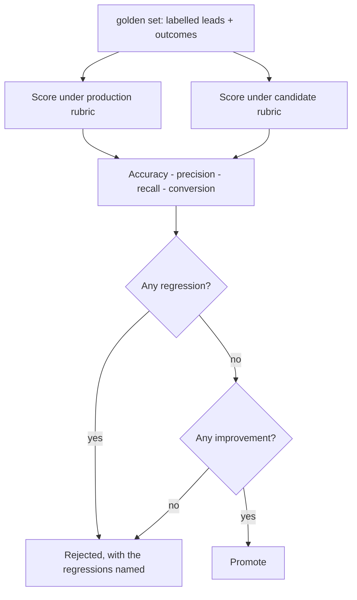

# 15 — Evaluation Harness

A candidate scoring rubric is promoted by arithmetic, or not at all.

`Live tested` · [`workflow.json`](workflow.json)

## What it does

- Scores a labelled golden set under the production rubric and a candidate rubric, through the real qualification workflow rather than a reimplementation of it.
- Measures tier accuracy, HOT precision, HOT recall and the conversion rate of the leads each rubric calls HOT.
- Promotes only when the candidate regresses on nothing and improves something. A tie is not a promotion.
- Reports every disagreement between a rubric and its human label instead of hiding them in an aggregate.
- Never asks a model whether the new rubric is better — that is the judgement a model is worst placed to make about its own output.

## Flow

Calls 12 Lead Qualification.

## Setup

No credentials of its own beyond the shared services it calls.

No credentials of its own. It runs entirely through workflow 12 with supplied signals, so an evaluation makes no model call and costs nothing to re-run.

Run it from `Run Evaluation`.

Credentials and data tables: [docs/CONNECTIONS.md](../../docs/CONNECTIONS.md)

## Test evidence

| Result | Raw output |
| --- | --- |
| 12 labelled leads, candidate rejected | [`tests/results-2026-09-12.json`](tests/results-2026-09-12.json) · execution `718` |

Both rubrics are scored through the real qualification workflow with supplied signals, so no model call is made and the run is free to repeat. The promotion gate is arithmetic over the labelled rows; no model is consulted about whether the candidate is better.

## Limitations

- Twelve labelled leads is enough to catch a direction, not enough to trust a decimal place. Grow the set before treating a 2-point move as real.
- The labels are one person's judgement. A second labeller would move the numbers.
- Outcomes in the golden set are recorded, not attributed — a lead that converted may have converted regardless of what the rubric said.
- Only the rubric is under test. Prompt and model changes need their own comparison.
