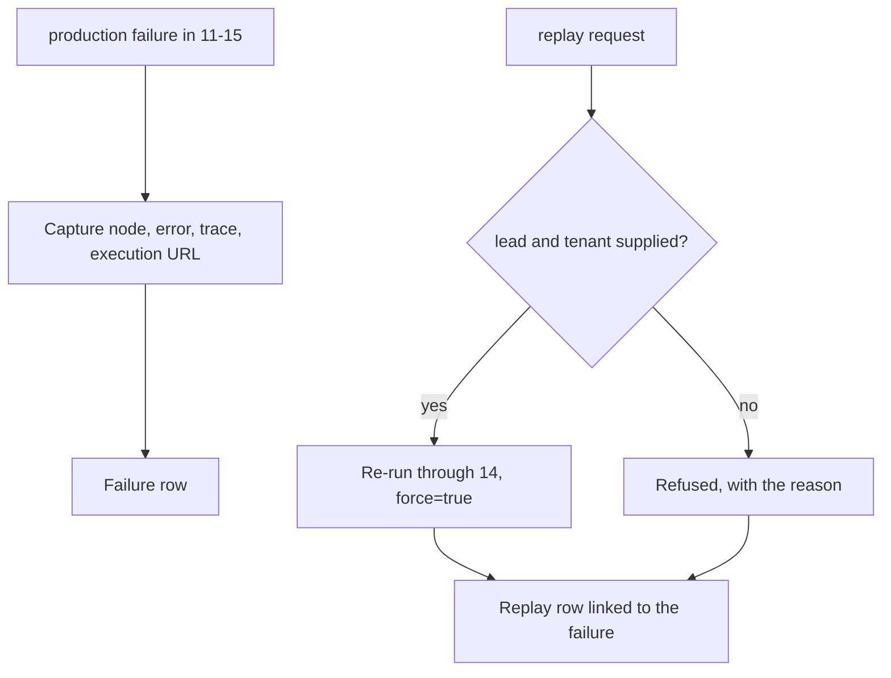

# 16 — Failure Handler

Where a broken production run goes, and how it gets run again.

`Live tested` · [`workflow.json`](workflow.json)

## What it does

- Catches any production failure in 11-15 and records the failing node, the error, the trace id when the payload carries one, and the execution URL.
- Admits what it does not know: the Error Trigger is not handed the failing run's input, so an unrecoverable tenant or trace is left blank rather than guessed at.
- Replays a supplied lead through 14 with `force` set, because without it the ledger would suppress the re-run as a duplicate and the replay would silently do nothing.
- Keeps `dry_run` defaulting to true on a replay. Re-running something that broke is not a licence to write.
- Appends rather than overwrites, so the history of what broke and what was done about it survives.

## Flow

Calls 14 Revenue Swarm.

## Setup

No credentials of its own beyond the shared services it calls.

No credentials. Set it as the error workflow on 11-15 (already done on this instance); n8n fires it for production executions only, never for a manual test run.

Run it from `Workflow Failed` or `Replay Request` or `Test Suite Trigger`.

Credentials and data tables: [docs/CONNECTIONS.md](../../docs/CONNECTIONS.md)

## Test evidence

| Result | Raw output |
| --- | --- |
| 3/3 fixtures passed | [`tests/results-2026-09-12.json`](tests/results-2026-09-12.json) · execution `1018` |

Covers the replay leg only. n8n fires an error workflow for production executions, so the Error Trigger leg cannot be exercised from a manual test without deliberately breaking a live run. Re-run on this execution after the workflow 11 change: the replay path re-submits a lead through 14, which calls 11 for every CRM write.

## Limitations

- n8n fires an error workflow for **production** executions only. A failed manual test run is not captured, and that is why the suite here covers the replay leg only.
- The Error Trigger does not carry the failing run's input, so a replay needs the lead supplied by the caller. The execution URL is recorded precisely so a human can recover it.
- There is no automatic retry. Replay is a deliberate act, because most failures here are a bad payload or a missing credential and retrying those just fails again.
- No alerting. The failure table is queryable; routing it to a channel is one node and a credential.
